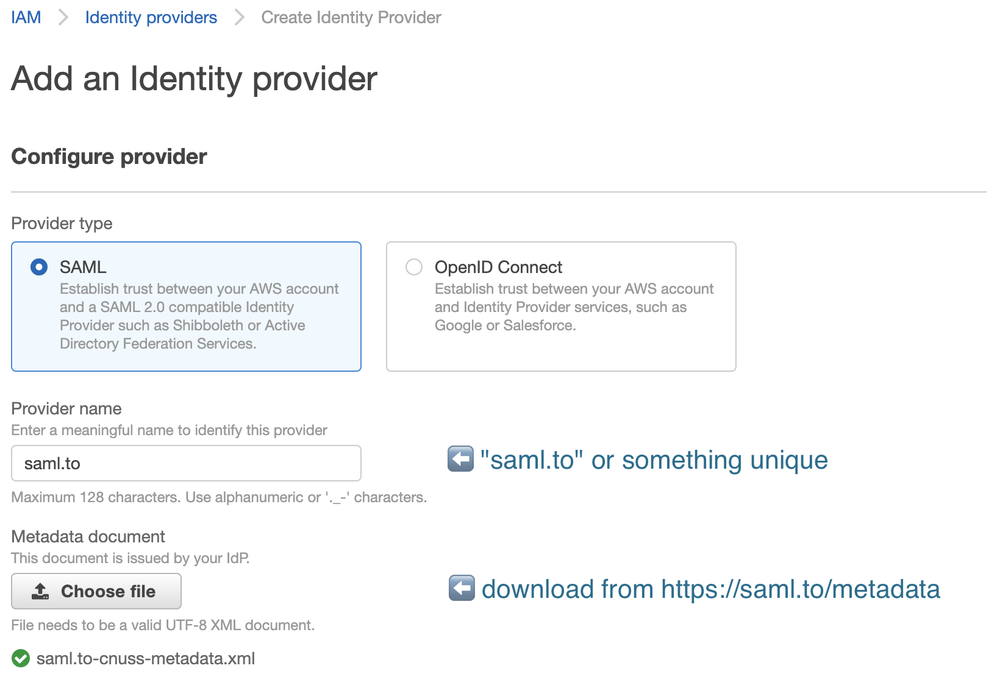
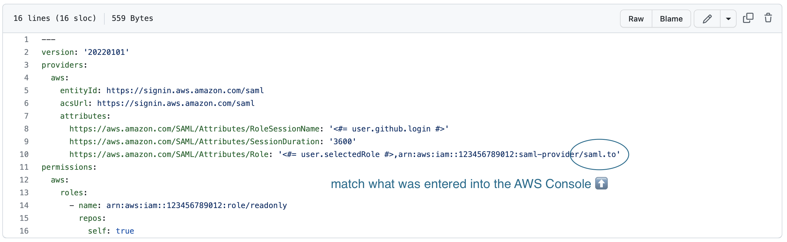

# Frequently Asked Questions

## I now have a slew of `saml-to.yml` files across many repositories, and it's quite repetitive.

If you have multiple SAML.to files across many repositiories, they can be consolidated into one configuration file in a single repository in your GitHub Organization. It can be used delegate access to other repositories.

Need more info on this? [Message us on Gitter](https://gitter.im/saml-to/assume-aws-role-action).

## I have many repositories that need this action, but creating a SAML Provider in AWS per-repository won't scale.

If all repositories need access to the same role, make a new "Shared Provider" (sans the Repository Name) and place that in the various `saml-to.yml` configuration files.

### Step 1 - Create a "Shared Provider"

1. When creating a provider, set the name to something generic, but unique to your AWS account. In this example, it's named as `saml.to`.

1. Download your [`IdP Metadata`](https://saml.to/metadata) for your organization from SAML.to.

### Step 2 - Update each of the `saml-to.yml` file(s) to use the "Shared Provider"

1. Change the `https://aws.amazon.com/SAML/Attributes/Role` to use the name of the "Shared Provider"
